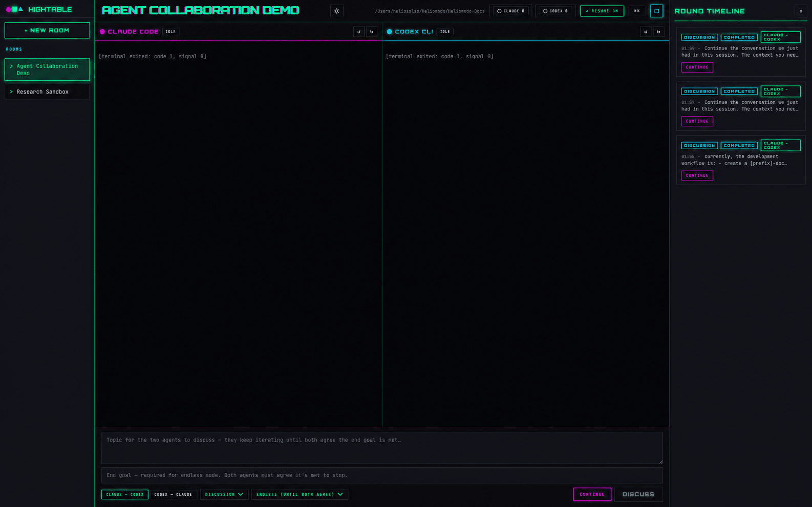
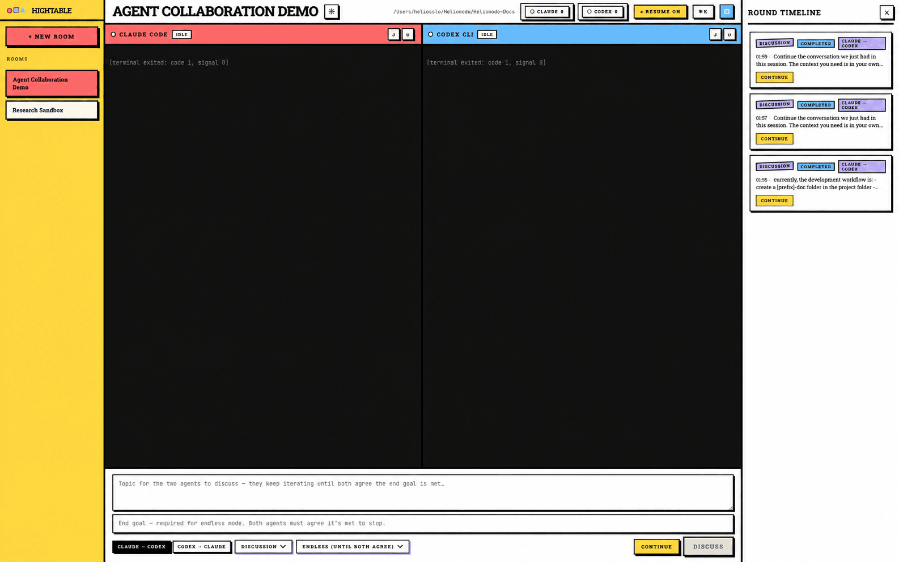

# Hightable

A local desktop workbench for running **Claude Code CLI** and **Codex CLI** side by side, in real terminal sessions, from a single prompt surface.

Hightable is not an agent framework. It does not hide the underlying CLIs, replace their permissions/approvals, or scrape vendor state files. It opens persistent Claude and Codex terminals in one window, lets you send prompts to either or both, captures useful output, and stores transcripts and round metadata locally for review and comparison.





## Features

- Two long-lived terminal sessions (Claude Code, Codex) in one window, backed by `node-pty` and `@xterm/xterm`.
- Shared prompt bar that can target Claude, Codex, both, or a controlled multi-step orchestration.
- Per-room isolation: each room binds one repository path to one topic and its two terminals.
- Round timeline with per-round transcripts, optional git diff capture, and export.
- Local-first storage in SQLite plus raw terminal log files. No cloud, no telemetry, no auto-update.
- Uses your existing `claude` and `codex` CLI authentication — Hightable never sees API keys.
- Light (Bauhaus) and dark (cyberpunk) themes.

## Workflows

**Sequential review.** One CLI produces an answer or patch, the other reviews it.

**Compare.** Same prompt to both CLIs, side-by-side independent responses. Read-only by default.

**Discuss.** Each CLI sees the other's response across capped rounds (default 2, max 3) and produces a synthesis.

**Manual.** Type into either terminal directly. Hightable stays out of the way.

## Status

MVP is wired end-to-end: Electron shell, SQLite-backed rooms, embedded Claude/Codex PTYs, manual prompt routing, round timeline, and per-room raw-log transcripts. Automated marker detection, full compare/review/discussion automation, and worktree isolation are in progress. See [`hightable-Docs/verification.md`](hightable-Docs/verification.md) for the acceptance checklist.

## Requirements

- macOS, Windows, or Linux
- Node.js 20+
- `claude` CLI on `PATH` ([install](https://docs.anthropic.com/claude/docs/claude-code))
- `codex` CLI on `PATH` ([install](https://github.com/openai/codex))
- Native build toolchain for `better-sqlite3` and `node-pty`:
  - macOS: Xcode Command Line Tools
  - Linux: `build-essential`, `python3`
  - Windows: `windows-build-tools` or Visual Studio Build Tools

## Install & Run

```bash
git clone https://github.com/<your-fork>/hightable.git
cd hightable
npm install
npm run dev
```

To package a desktop binary:

```bash
npm run package        # current platform
npm run package:all    # mac + windows + linux (where supported)
```

## Architecture

```text
src/
  main/              # Electron main process: PTY, SQLite, orchestration, IPC
  preload/           # contextBridge surface (no Node, no shell, no fs)
  renderer/          # React + xterm.js UI
  shared/            # IPC types, transcript scrubbing
hightable-Docs/      # design docs, MVP plan, wireframes, verification
```

Electron security defaults: `contextIsolation: true`, `sandbox: true`, `nodeIntegration: false`, strict CSP in production, navigation guard, `shell.openExternal` restricted to `http(s)`.

See [`hightable-Docs/architecture.md`](hightable-Docs/architecture.md) for the process model, data model, terminal lifecycle, and orchestration modes.

## Documentation

- [Architecture](hightable-Docs/architecture.md)
- [MVP Plan](hightable-Docs/mvp-plan.md)
- [UI Wireframes](hightable-Docs/ui-wireframes.md)
- [Verification](hightable-Docs/verification.md)

## Safety Defaults

- Compare and discussion modes are read-only unless explicitly changed.
- Sequential review lets only the primary CLI edit by default.
- Parallel implementation requires separate git worktrees.
- Hightable never sends an automated prompt to a terminal marked busy.
- Raw logs are stored before any cleanup or summarization.

## Contributing

Contributions are welcome. Please open an issue before starting non-trivial work. See [`CONTRIBUTING.md`](CONTRIBUTING.md) for development setup and style.

## License

MIT — see [`LICENSE`](LICENSE).
