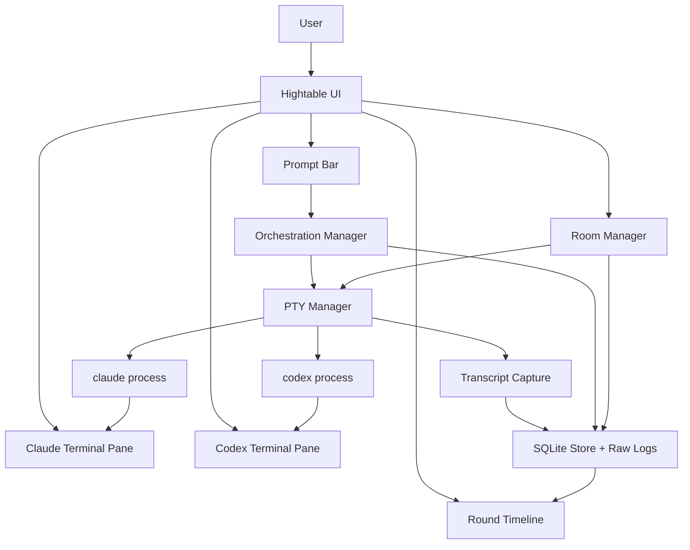

# Hightable Architecture

## Overview

Hightable is a local desktop workbench for coordinating Claude Code CLI and Codex CLI through persistent embedded terminals.

The central design constraint is that Claude and Codex are terminal-first products. Hightable should respect that. It should not pretend the CLIs are stable SDKs, and it should not hide the terminal from the user. Instead, it should wrap real terminal sessions with a thin orchestration layer that can send prompts, capture output, track rounds, and route context between tools.

## System Boundaries



## Main Process Responsibilities

The Electron main process owns anything that touches the operating system.

| Module | Responsibility |
| --- | --- |
| `pty-manager.ts` | Start, stop, resize, and write to Claude/Codex PTYs |
| `command-builder.ts` | Build CLI commands from repo, room, and agent settings |
| `room-manager.ts` | Create rooms, attach repositories, restore terminals |
| `orchestration-manager.ts` | Execute review, compare, and discussion workflows |
| `transcript-capture.ts` | Store raw PTY streams and derive cleaned text |
| `sqlite-store.ts` | Persist rooms, rounds, terminals, and message metadata |

The renderer should not spawn processes directly. It should call typed IPC methods exposed by the main process.

## Security Model

Hightable runs powerful local CLIs, so Electron's renderer must stay unprivileged.

Hard constraints:

- Use `contextIsolation: true`.
- Use `nodeIntegration: false`.
- Prefer `sandbox: true` once the preload bridge has no Node-only renderer assumptions.
- Expose only the narrow `window.hightable` preload API.
- Do not expose raw `ipcRenderer`, filesystem APIs, shell APIs, or PTY handles to the renderer.
- Add a Content Security Policy before remote or bundled assets are introduced.

The main process owns filesystem, SQLite, PTY, and git operations. The renderer only sends typed user intents and receives typed events.

## Renderer Responsibilities

The renderer presents the operator interface.

| Component | Responsibility |
| --- | --- |
| `TerminalPane` | Render an `@xterm/xterm` pane and forward input/resizes |
| `PromptBar` | Compose prompts and choose target mode |
| `RoomSwitcher` | Create, select, and resume rooms |
| `RoundTimeline` | Show prompt rounds, status, and extracted responses |
| `CompareView` | Show Claude/Codex answers side by side |

The renderer should always show the real terminals. Extracted responses are convenience views, not the source of truth.

## Data Model

SQLite stores structured metadata. Raw logs are stored as files.

```sql
CREATE TABLE rooms (
  id TEXT PRIMARY KEY,
  name TEXT NOT NULL,
  repo_path TEXT NOT NULL,
  topic TEXT,
  created_at TEXT NOT NULL,
  last_used_at TEXT NOT NULL
);

CREATE TABLE terminals (
  id TEXT PRIMARY KEY,
  room_id TEXT NOT NULL,
  agent TEXT NOT NULL,
  command TEXT NOT NULL,
  cwd TEXT NOT NULL,
  status TEXT NOT NULL,
  started_at TEXT NOT NULL,
  stopped_at TEXT,
  FOREIGN KEY (room_id) REFERENCES rooms(id)
);

CREATE TABLE rounds (
  id TEXT PRIMARY KEY,
  room_id TEXT NOT NULL,
  mode TEXT NOT NULL,
  prompt TEXT NOT NULL,
  status TEXT NOT NULL,
  started_at TEXT NOT NULL,
  completed_at TEXT,
  FOREIGN KEY (room_id) REFERENCES rooms(id)
);

CREATE TABLE messages (
  id TEXT PRIMARY KEY,
  round_id TEXT NOT NULL,
  terminal_id TEXT,
  agent TEXT NOT NULL,
  direction TEXT NOT NULL,
  raw_text_path TEXT,
  cleaned_text TEXT,
  created_at TEXT NOT NULL,
  FOREIGN KEY (round_id) REFERENCES rounds(id),
  FOREIGN KEY (terminal_id) REFERENCES terminals(id)
);

CREATE TABLE artifacts (
  id TEXT PRIMARY KEY,
  round_id TEXT NOT NULL,
  kind TEXT NOT NULL,
  path TEXT NOT NULL,
  created_at TEXT NOT NULL,
  FOREIGN KEY (round_id) REFERENCES rounds(id)
);
```

Suggested log layout:

```text
~/.heliomodo/hightable/
  rooms/
    <room-id>/
      claude.raw.log
      codex.raw.log
      rounds/
        <round-id>.json
        <round-id>.claude.cleaned.txt
        <round-id>.codex.cleaned.txt
        <round-id>.diff
```

## Room Path Model

Each room is path-first. Room creation requires the user to select or enter a local filesystem path, and Hightable stores that exact path as `rooms.repo_path`.

Rules:

- `repo_path` is required for every room.
- The path must exist and must be a directory before terminals are launched.
- Hightable passes the selected path directly to Claude and Codex.
- Hightable does not integrate with SourceTree.
- Hightable does not import repository lists, working tree state, or bookmarks from SourceTree.

This keeps Hightable independent from GUI git clients and makes the room contract simple: one room maps to one local path.

## Terminal Lifecycle

Each room owns one Claude terminal and one Codex terminal.

Startup:

1. User creates or opens a room.
2. Hightable validates the selected local repo path.
3. Hightable starts Claude and Codex PTYs if they are not already running.
4. Renderer attaches an `@xterm/xterm` instance to each PTY stream.
5. Transcript capture begins before the first automated prompt is sent.

Shutdown:

1. User can close a room, stop one terminal, or quit the app.
2. Hightable records terminal status and stops the PTY process.
3. Existing Claude/Codex CLI session history remains owned by the CLIs.

Hightable should not assume it can restore an interactive process after app restart. It can restore the room and launch a new terminal, optionally using the CLI's own resume command in a later milestone.

## PTY Sizing

Initial PTY size should default to `120` columns by `32` rows before the terminal pane measures itself. After mount, `TerminalPane` must use the xterm fit addon to calculate rows and columns from the visible pane, send those dimensions to `pty-manager`, and repeat that flow on window or pane resize. Header/status changes must not alter terminal dimensions.

## Orchestration Modes

### Manual

The prompt bar can send text to either terminal, but no structured round is required. Manual keystrokes are still logged.

### Compare

The same marked prompt is sent to both terminals. Hightable waits for both done markers or manual completion.

### Sequential Review

The primary terminal receives the user prompt. After completion, Hightable builds a review prompt containing the primary response, optional git diff, and review instructions, then sends it to the secondary terminal.

### Discussion

The orchestrator alternates rounds. Each agent sees the other agent's previous response and a bounded instruction for the next turn. Discussion mode should stop after the configured max rounds even if disagreement remains.

## Completion Detection

Automated rounds use markers by appending explicit instructions to the prompt sent into the terminal:

```text
[HM_RUN_BEGIN:<round-id>]
[HM_RUN_DONE:<round-id>]
```

Claude Code and Codex are not guaranteed to echo the begin marker or emit the done marker reliably. Marker detection is therefore best-effort, not the only completion path.

The capture layer should:

1. Record the raw stream continuously.
2. Strip ANSI escape codes into a cleaned text buffer.
3. Start a round capture at the moment Hightable writes the prompt into the PTY.
4. Detect the done marker if the model emits it.
5. Mark the terminal idle when a marker, manual completion, timeout, or stop action resolves the round.

Fallbacks:

- Manual "mark complete" button.
- Timeout with "needs attention" status.
- Stop button that leaves the terminal process alive but cancels the orchestration wait.

## Editing and Repo Safety

Hightable should distinguish read-only reasoning from file editing.

Recommended defaults:

| Mode | Default repo policy |
| --- | --- |
| Manual | User controlled |
| Compare | Read-only prompt instructions |
| Sequential review | Primary may edit, reviewer read-only |
| Discussion | Read-only prompt instructions |
| Parallel implementation | Separate worktrees required |

For implementation workflows, Hightable should be able to capture:

```bash
git status --short
git diff --stat
git diff
```

The first version can run these commands outside the embedded terminals from the main process, as explicit artifact collection.

MVP mitigation: Hightable should prepend automated compare and discussion prompts with read-only wording. Manual terminal use remains user-controlled, and MVP trusts the user not to ask both CLIs to edit the same checkout at the same time. Parallel editing must wait for worktree isolation.

## Error Handling

Expected failures:

- CLI binary missing.
- CLI not logged in.
- Repo path does not exist.
- Terminal process exits unexpectedly.
- Done marker not emitted.
- User manually types while an automated round is in progress.
- Both agents attempt to edit the same checkout.

The app should surface these as room or round states rather than hiding them in logs.

Useful states:

```text
idle
starting
busy
needs_attention
failed
stopped
```

## Open Design Choices

- Electron vs Tauri. Current recommendation is Electron because `node-pty` and `@xterm/xterm` make the first implementation simpler.
- npm vs pnpm. Pick one at scaffold time and keep it consistent.
- Whether to add non-interactive resume mode later for cleaner JSON output.
- Whether to implement worktree isolation in milestone 1 or milestone 2.
